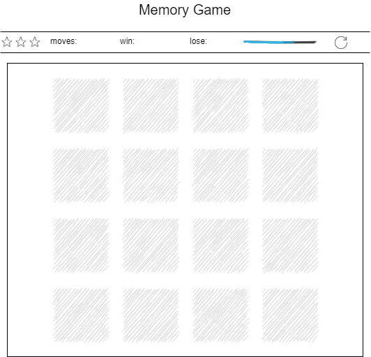
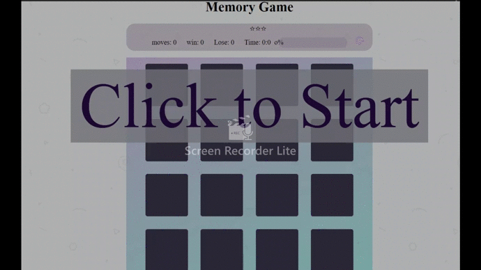

# Memory Matching Game

The memory game is a basic matching game to test the player's ability to memorize cards place and match the pairs successfully

## How The Game Works

The game board consists of sixteen cards. The deck is made up of eight different pairs of cards, The cards are arranged randomly on the board.

### Game behavior

- The player flip two at the same time.
- The card will by remain open if the cards match
- If the cards do not match, both cards are flipped face down.
- If all cards have been correctly matched before time up then the player is win

## Getting Started

Access to the [Game](https://pages.git.generalassemb.ly/bushra-mulla/Memory-Matching-Game/)

## Technologies Used In The Project

- JavaScript
- HTML
- CSS
- jQuery library

## wireframes / Game Web Page

## User Stories

- As a user, I should be able to start a new memory matching game.
- As a user, I should be able to click on a card to flip the first card and then the second card, and so on.
- As a user, I should be shown the cards have been correctly matched and the moves count.
- As a user, I should not be able to click the same card twice.
- As a user, I should be shown a message when I win, lose.
- As a user, I should not be able to continue playing once I win, lose.
- As a user, I should be able to play the game again without refreshing the page.
- As a user, I should be able to show result achieved.

## Project Plan

It's very important to plan your project before start writing code, and think for what you going to build

- started by Write the Requirements for the game
- Write the process / flow the code
- started by created HTML file
- After that I started doing basic design using CSS.
- Then started writing pseudocode for logic of the game following the process that I written before and make the functions interconnected
- In real code I started by flipping card that all other function connected with, So I can test the game flow
- Then thought for Shuffle the card to make it randomize
- Thought how the game can find the winner by matching the card selector and check if it's matching
- And after that start working in score panel that show the progress in the game.
- Last thing make the function that reset the game and save the result achieved by the player (loss or win).

## Future updates to project

- Allow 2 players to play with each other, and can play online
- Make levels for cards, so the player can choose from it
